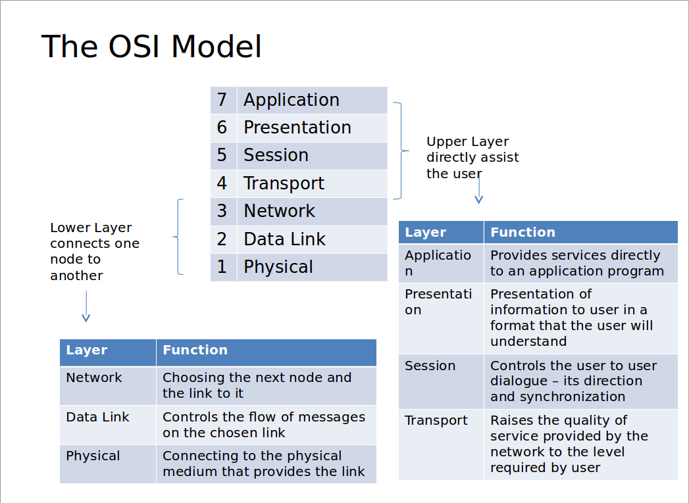

# OSI model NETWORKING :

OSI stands for Open Systems Interconnection model, defines networking in terms of a vertical stack of seven layers. These seven Layers are :

* Application
* Presentation
* Session
* Transport
* Network
* Data-Link
* Physical

Data communication in the OSI model starts with the top layer of the stack at the sending side, travels down the stack to the sender's lowest layer, then traverses the network connection to the bottom layer on the receiving side and up its OSI model stack.

**PHYSICAL LAYER :**

Lowest layer of the OSI model, it is concerned with the transmission and reception of the bit stream over a physical medium. It describes the electrical/optical, mechanical and functional interfaces to the physical medium.

**DATA LINK LAYER :**

It provides error-free transfer of data frames from one node to another over the physical layer. 
* Establish logical link between two nodes
* Controls frame traffic
* Transmits and receive frames sequentialy
* Create and recognize frame boundries
* Frame error checking

**NETWORK LAYER :**

The network layer control the operation of the network, deciding which physical path the data should take based on network condition and priority of service. It provides :
* Routing frames in network
* Logical-Physical address mapping
* Subnet traffic control etc.

**TRANSPORT LAYER :**

This layer relieves the higher layer protocols from any concern with the transfer of data between them and their peers. It provides
* Message segmentation: disassmebles and reassembles the message semgements.
* Reliable end-to-end message delivery
* Message traffic control and session multiplexing.

Typically Transport layer accepts large messages from higher layer breaks the message into smaller units prepending a header that include control information such as message start and end flags and sequence information.

This  layer is true **Source to Destination** and is not concerned with the details of the underlying communication facility unlike Network Layer.

Transport layer uses different protocol to serve its purposes like TCP(Transfer control protocol) UDP(User Datagram Protocol)

**SESSION LAYER :**

This layer allows session establishment between processes running on differnet stations. It provides
* Session establishments, maintainance and termination

**PRESENTATION LAYER :**

This layer formats the data to be presented to the application layer. It works as a translator for the network. It converts format from a common format for sending and recieving station to a format known to application layer. It provides.
* Character code translation
* Data conversion and compression
* Data encryption

**APPLICATION LAYER :**

This layer is closest to the user. It serves as a window for users and application processes to access network services.

TCP/IP protocols for each layer as example :

Layer | TCP/IP Protocol
---- | ----
Application | DNS, FTP, HTTP, SMTP etc.
Presentation | MIME, SSL, TLS etc.
Session | Sockets
Transport | TCP, UDP etc
Network | IP, Ipsec, RIP etc
DataLink | PPP, SBTV, SLIP
Physical |  

