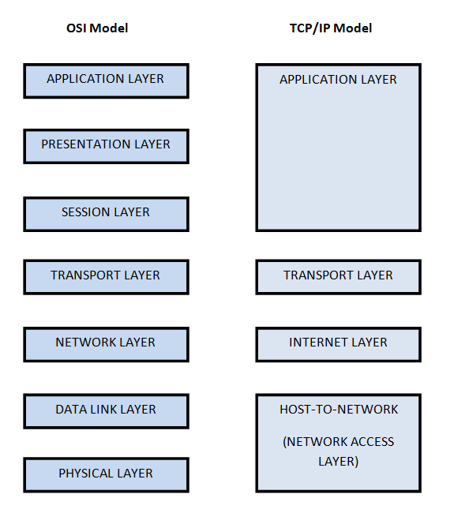

# TCP/IP protocol Architecture

TCP/IP protocol map to a four-layer conceptual model known as DARPA model. The four layers of this models are Application, Transport, Internet and Network Interface. Each layer in TCP/IP model corresponds to one or more layers of the seven-layer Open-System interconncetion(OSI) model.

The towo major protocols in this suite are TCP(Transmission Control Protocol) and IP(Internet Protocol).

### Network Access Layer

The network access layer(also network interface layer) is responsible for placing TCP/IP packets on the network medium and recieving TCP/IP packets off the network medium.

It encompasses the Data-Link and Physical Layer of the OSI model.

TCP/IP was designed to be independent of the network access method, frmae format, and medium owing to which it can be used to connect to differing network types including LAN, WAN etc. Independene from any specific network technology gives TCP/IP the ability to be adapted to new technologies such as ATM.

### Internet Layer

The internet layer of TCP/IP model is responsible for addressing, packaging and routing functions, the core protocols of Internet Layer are IP, ARP, ICMP and IGMP.

* The internet Protocol(IP) is a routable protocol responsible for IP addressing, routing, and fragmentation and reassembly of packets.

* Address Resolution Protocol(ARP) is responsible for the resolution of the internet layer address to the network interface layer adress such as a hardware address

* ICMP is responsible for providing diagnostic function and reporting errors.

### Transport Layer

This layer is responsible for providing the application layer with session and datagram communictaion services TCP and UDP are the core protocol of the Transport Layer.

* TCP provides a one to one, connection oriented, reliable communication service. It is responsible for the establishment of connection sequencing and acknowledgement of the packets sent, and recovery of the packets lost during the transmission. TCP is a connection oriented protocol that is once the connection is established data can be sent bidirectional

* UDP provides a one to one or one to many connectionless, unreliable communication service. UDP is used when the amount of data to be transferred is small.

TCP provides high reliability for the message transfer, it also arranges the data packets in the order specified while UDP provides fast and efficient transmission as in games having no inherent order as all the packets are independent of each other.

* For a TCP connection to be established a three way handshake is required while for UDP no handshake is required (connectionless protocol)

The transport layer encompasses the responsibilities of the OSI transport layer an some of the responsibilities of the OSI Session layer.

### Application Layer

The application layer provides the ability to access the services of the other layer and defines the protocols that application use to exchange data. Some Application layer protocols are :

* HTTP(Hyper text transfer protocols)
* FTP(File Transfer protocol)
* SMTP(Simple Mail Transfer Protocol)
* DNS